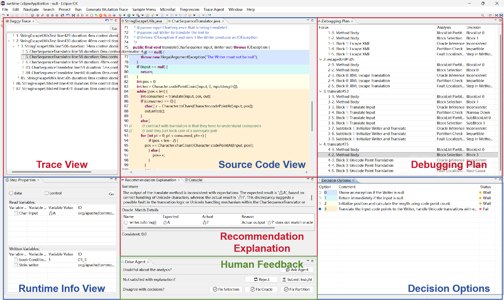
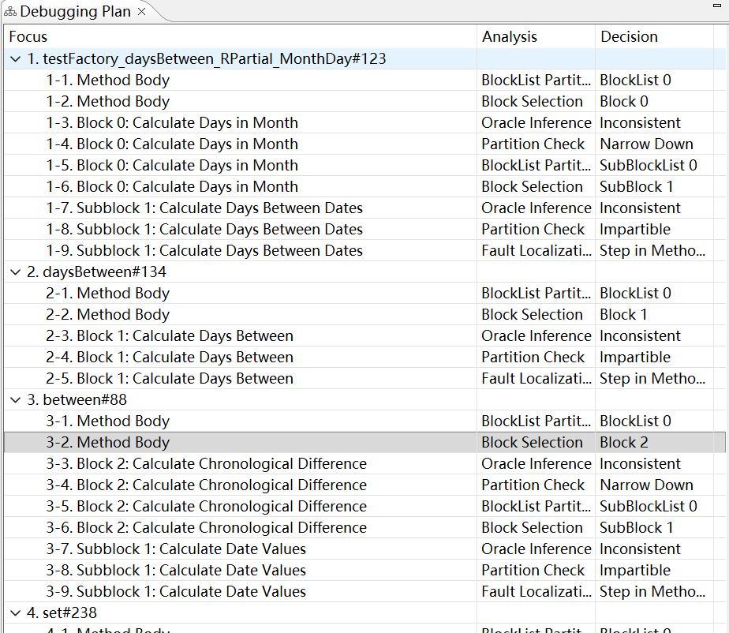
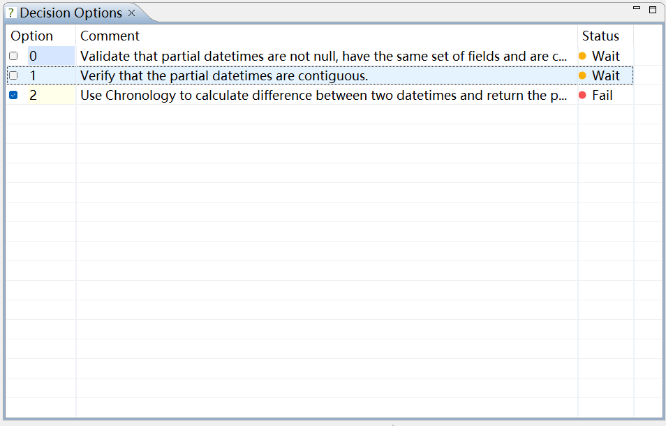
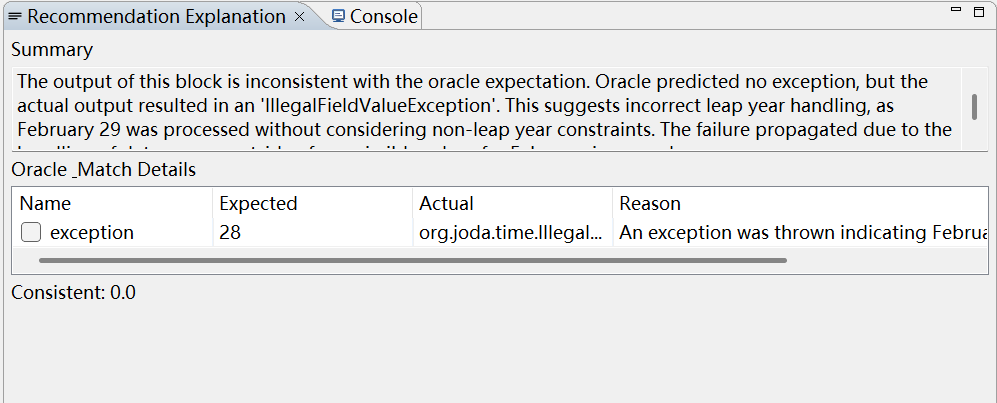
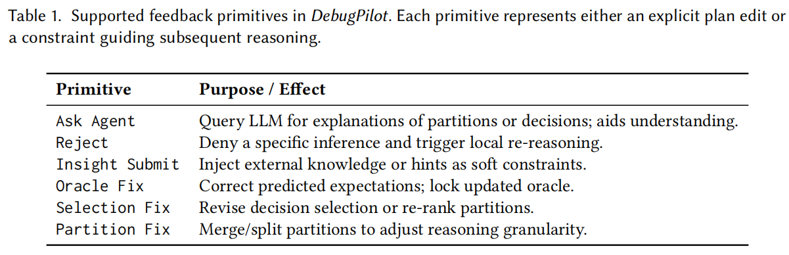
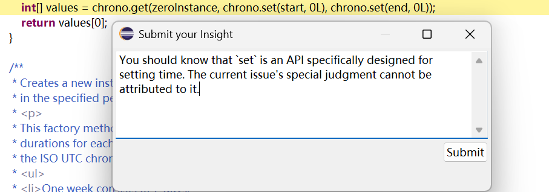
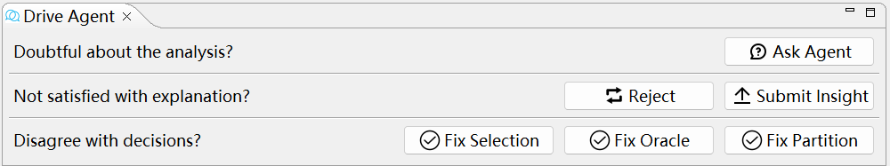
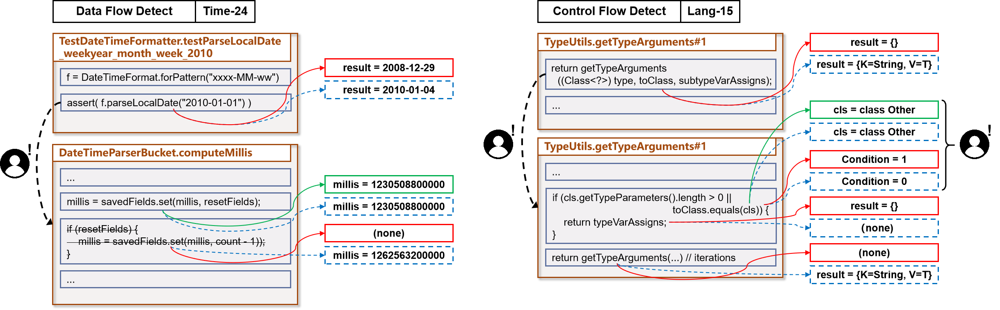
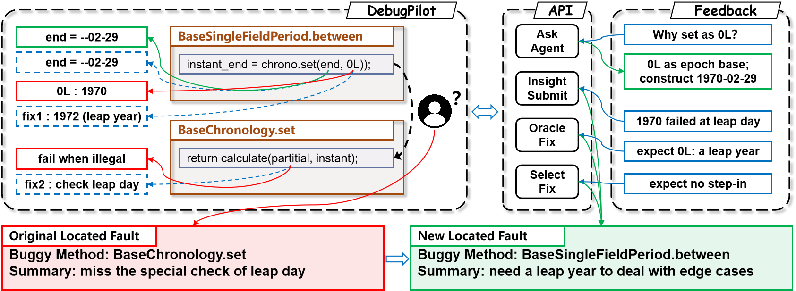

# DebugPilot

Debugging Code Execution with Inferred Runtime Oracle

- **Cognitive** Divide code snippets into blocks, revealing where intentions begin to diverge. 
- **Reliable** Infer expected intermediate values, validating each step through verifiable consistency. 
- **Collaborative** Collaborate with the agent, refining and steering the reasoning process.

---

## References

This website corresponds to the supplementary artifact of the ISSTA 2026 submission "**DebugPilot: Debugging Code Execution with Inferred Runtime Oracle**".

The following sections of the paper reference this site:

1. **Abstract** "The tool demonstration, source code, and more experimental results are available at *(this website)*."
2. **Introduction** "Given the space limit, the tool demonstration, source code, and more experimental results are available at *(this website)*."
3. **Approach** "Interested audience can check our LLM prompt design at *(this website)*."
4. **Data-Availability Statement** "The implementation of DebugPilot, along with evaluation scripts and experimental results, is available at *(this website)*."

---

## Plugins

**DebugPilot** is implemented as a set of Eclipse plugins that extend the time-travel debugging environment with semantic reasoning and interactive visualization.

This part introduces the main views and the supported interaction primitives. 

### Debugging Views Overview



**Debugging Plan** 



The **Debugging Plan View** visualizes the reasoning process of the recursive debugging framework.

Each entry corresponds to a semantic execution block, showing how the system progressively narrows down inconsistencies across nested function calls.

The *Analysis* column indicates the current step of debugging — for example *Block Partition*, *Oracle Inference*, or *Fault Localization* — while the *Decision* column records the final decision made after that analysis.

Together, these two columns form the backbone of the Debugging Plan, capturing both the *reasoning process* and its *outcome* at each stage.

This hierarchical structure allows users to trace where and why the failure emerges within the program execution. 

**Decision Options**



The **Decision Options View** lists all reasoning alternatives generated for the currently focused block in the Debugging Plan.

Each option represents a possible explanation or corrective hypothesis (e.g., validating inputs, verifying preconditions, or computing derived values).

The *Status* column indicates the evaluation result of each option—such as *Wait*, *Pass*, or *Fail*—allowing users to inspect how the agent tested competing hypotheses against runtime evidence.

This view bridges high-level planning with concrete semantic choices, helping users understand why a specific path was selected. 

**Recommendation Explanation**



The **Recommendation Explanation View** provides natural-language summaries of the agent’s reasoning for a specific decision.

It contrasts expected and actual runtime values inferred by the Oracle, highlights detected inconsistencies, and explains their propagation through the execution trace.

For example, as shown here, the view reports that the failure stems from missing leap-year handling in *February 29*, linking the observed exception back to the violated expectation.

This interpretive feedback makes every localization decision transparent and verifiable. 

### Interaction Support



**Doubtful about the analysis?**


The **Ask Agent** interaction allows users to query the debugging agent directly within the IDE.

When uncertain about a partition, variable value, or decision, the user can ask natural-language questions (e.g., *“Why does 0L mean here?”*).

The agent responds with contextual explanations grounded in program semantics and trace evidence, helping the user interpret how the model inferred its expectations or selected a reasoning path.

This promotes transparency and enables informed follow-up actions during the debugging process. 

**Not satisfied with explanation?**



The **Reject** and **Insight Submit** interactions enable users to inject human judgment into the reasoning loop.

* **Reject** provides lightweight negative feedback—denying a specific inference or plan entry, prompting the agent to locally re-reason.
* **Insight Submit** conveys domain knowledge or contextual hints (e.g., “set() is an API specifically designed for setting time ...”), which are stored as soft constraints for subsequent reasoning rounds.

Together, these primitives realize knowledge-level collaboration, allowing DebugPilot to refine its understanding and avoid repeated conceptual errors.

**Disagree with decision?**

**DebugPilot** further supports three **Fix** operations that directly modify the ongoing reasoning plan:

* **Selection Fix:** Revises an incorrect decision or re-ranks reasoning options.
* **Oracle Fix:** Updates an erroneous expected value and locks the corrected Oracle for future consistency checks.
* **Partition Fix:** Merges or splits semantic partitions to adjust reasoning granularity.

These edits act as *direct manipulations* of the debugging plan, allowing users to incrementally steer the agent toward the true root cause.

### Usage

**Record Trace**

Use the Eclipse plugin to execute the failing test case on the buggy program. By clicking the button, a complete execution trace is recorded.

After this step, the Trace View and Runtime Info View become available, allowing both the user and DebugPilot to inspect runtime information at any checkpoint.

An existing open-source tracing framework is used to perform this preliminary task in a fully reproducible manner.

**Run DebugPilot**

Click the button to automatically launch DebugPilot’s fault localization process.

After this step, the Debugging Plan, Decision Options, and Recommendation Explanation views become available.

The user can review the decision information within these views to confirm the fault location and examine the entire debugging process.

**Provide Feedback**



When the user wishes to request further explanations or intervene in the reasoning process, human feedback controls are available in the Drive Agent View.

These controls are provided as buttons or dialog prompts, enabling direct interaction.

The supported feedback mechanisms are described in the section above.

### implementation

For anonymity and ease of evaluation, we provide a standalone Python implementation that reproduces the core reasoning and evaluation pipeline of DebugPilot, without relying on the Eclipse plugin environment. The Eclipse-based version will be made available after acceptance. 

---

## Approach

**Agents** The following introduces the eight prompt-defined agents used throughout the DebugPilot process.

### Agent - Partition

**Agent Partition** analyzes the source code together with historical debugging records to perform semantic partitioning and divide the program into interpretable units.

```
DebugPilot focuses on a new code snippet and calls debugging agent Partition. For Partition, User will provide:
1. code: current code snippet for partition
2. context: context of debugging history, including prior method definitions that influence this code snippet
3. test: test scenario and failure description
4. stack: call stack trace, from test unit to current method

<code>
{code}
</code>

<context>
{context}
</context>

<test>
{test}
</test>

<stack>
{stack}
</stack>

Agent Task (Partition): Providing Semantic Block Partition
Please analyze the given code snippet and complete the following:

0. Definition of legal semantic block (Important):
   - A block must be a continuous sub-segment of the given code snippet.
   - Blocks must maintain a sequential execution order, reflected in the execution trace as: block1 -> block2 -> ... -> block_k.
   - Blocks must not be placed inside loops. When encountering nested loops, the block can only wrap the outermost loop.
      - This ensures each block appears at most once in the execution trace.

1. Determine Partition Boundaries and Global Semantics:
   - Identify the start line and end line that mark the range of executable code, excluding documentation and signatures.
   - Describe the intended semantic task of the entire code snippet, based on the debugging context and expected behavior (i.e., what is this code supposed to do if bug-free).

2. Perform Semantic Block Partitioning:
Within the identified [start_line, end_line], select breakpoints to divide the code into semantic blocks.
   - Each block should be described by a line and a comment:
   - line: the last line of this block 
     - The endline is included in this block.
     - The start line is implicitly the previous block’s line + 1, or start_line for the first block
   - comment: a concise description of the intended correct semantics of this block.
   - Describe what it is supposed to do, not necessarily what it currently does.
   - When code and context disagree, trust the context to infer the correct intention.

3. Output Format:
Return a standardized multi-line string in this format (regex-friendly, avoid using similar delimiters in comments).
Especially, when the code snippet is an impartible loop block, just return only one block

one-shot example:
for input
<code>
43      /**
44       * set bound.
45       */
46      public setBound(double lowerBound, double upperBound) {{
47          if (lowerBound >= upperBound) {{
48              throw new IllegalArgumentException()
49          }}
50          this.lowerBound = lowerBound;
51          this.upperBound = lowerBound;
52      }}
</code>

the output is:
<format>
"start_line": 47,
"end_line": 52,
"description": "a method setBound to set a legal bound range",
- "line": 49, "comment": "throw if bound illegal",
- "line": 52, "comment": "set lowerbound and upperbound if bound legal" 
</format>
```

### Agent - Selection

**Agent Selection** selects suspicious targets from the newly partitioned code segments, guided by historical debugging information.

```
DebugPilot focuses on a new code snippet and calls debugging agent Selection. For Selection, User will provide:
1. code: current code snippet to be analyzed
2. context: context of debugging history, including prior method definitions that influence this code snippet
3. list: the semantic block list of the code snippet

<code>
{code}
</code>

<context>
{context}
</context>

<list>
{list}
</list>

Agent Task (Selection): Providing Critical Block Selection
Please analyze the given block list and complete the following:

1. Analyze Fault Relevance of Each Block
   - Based on the semantic meaning of each block and the debugging context, assess the degree of relevance between each block and the described failure.
   - Consider factors such as:
      - blocks that modify or return faulty values
      - blocks that handle or propagate incorrect logic
      - blocks that are semantically inconsistent with the overall task described in the context

2. Select the Most Suspicious Critical Block
   - Choose one semantic block that is the most suspicious based on the above analysis.
   - This block will be selected for further inspection in the debugging process.

3. Output Format:
Return a standardized multi-line string in this format (regex-friendly, avoid using similar delimiters in comments).

one-shot example:
for input
<list>
- ID: 0, Line 47-49: throw if bound illegal
- ID: 1, Line 50-52: set lowerbound and upperbound if bound legal
</list>

the output is:
<format>
"analysis": "Contexts find that the upperBound is written incorrectly so the block of bound setting needs to be checked."
"id": 1
</format>
```

### Agent - Abstraction

**Agent Abstraction** summarizes the semantics of a suspicious code segment by omitting implementation details and focusing on its core intent.

```
DebugPilot focuses on a new code snippet and calls debugging agent Abstraction. For Abstraction, User will provide:
1. code: current code snippet to be analyzed
2. context: context of debugging history, including prior method definitions that influence this code snippet
3. selected: the selected semantic block for debugging

<code>
{code}
</code>

<context>
{context}
</context>

<selected>
{selected}
</selected>

Agent Task (Abstraction): Providing Critical Block Abstracted Presentation
Please analyze the given selected block and complete the following:

1. Abstract the Selected Block into an Abstracted Presentation
   - The abstracted presentation should be described by a signature and an intent.
   - signature: a concise 2–3 word title summarizing the block.
   - intent: a short sentence describing the semantic purpose of the block.
   - Guidelines:
      - The description should reflect the intended correct behavior (not the actual buggy implementation).
      - When there is a conflict between the code and its context, prefer the context to infer the correct semantic goal.
      - The intent should be concise and general, ignoring low-level implementation issues or detail-level mistakes.

2. Output Format:
Return a standardized multi-line string in this format (regex-friendly, avoid using similar delimiters in comments).

one-shot example:
for input
<selected>
- ID: 1, Line 50-52: set lowerbound and upperbound if bound legal
</selected>

the output is:
<format>
"signature": "Set Legal Bound",
"intent": "set lowerBound and upperBound."
</format>
```

### Agent - Extraction

**Agent Extraction** retrieves and filters historical debugging constraints that are relevant to the current semantic task.

```
DebugPilot focuses on a new code snippet and calls debugging agent Extraction. For Extraction, User will provide:
1. selected: the selected semantic block for debugging
2. list: the semantic block list of the code snippet
3. context: context of debugging history, including prior method definitions that influence this code snippet

<selected>
{selected}
</selected>

<list>
{list}
</list>

<context>
{context}
</context>

Agent Task (Extraction): Providing relevant Historical Expectation
Please analyze the given selected block and complete the following:

1. Analyze Historical Context and Extract Relevant Expectations
   - The context may contain prior method analysis along the call trace. These include error reports or inconsistencies that may assist in diagnosing the current snippet.
   - From this context, extract pieces of information most relevant to the selected block, and summarize them into standardized expectations.
   - Do not create expectations based solely on code inspection; all extracted expectations must be explicitly mentioned in context.
   - Each expectation should include:
   - object: the subject of the expectation, typically a variable or field name
   - stage: the expected temporal state of the object, since the same object may have different values at different block stages.
   - expect: the expected value or behavior, ideally including both the value and a justification based on the context
      - If the expected value is not numeric, describe the expected property (e.g., "non-null", "true", "contains X").

2. Output Format:
Return a standardized multi-line string in this format (regex-friendly, avoid using similar delimiters in comments).

one-shot example:
for input
<context>
analysis from testBound[3:20]:
The inconsistency is due to the unexpected value 0.0 of upperBound, which is expected to be 1.0. So the failure may locate in the method of construction where the upperbound is written incorrectly.
</context>
<selected>
- ID: 1, Line 50-52: set lowerbound and upperbound if bound legal
</selected>
<list>
- ID: 0, Line 47-49: throw if bound illegal
- ID: 1, Line 50-52: set lowerbound and upperbound if bound legal
</list>

the output is:
<format>
- "object": "upperbound", "stage": "initialization", "expect": "1.0, which is the initialization value set in the test unit."
</format>
```

### Agent - Combination

**Agent Combination** integrates the abstracted semantics with extracted historical constraints to construct a Specification — a natural-language representation of the expected program behavior suitable for LLM reasoning.

```
DebugPilot focuses on a new code snippet and calls debugging agent Combination. For Combination, User will provide:
1. code: current code snippet to be analyzed
2. selected: the selected semantic block for debugging
3. presentation: the abstracted presentation of this block
4. expectation: the relevant historical expectation from context
5. input: relevant input from the selected block
6. output: relevant output from the selected block

<code>
{code}
</code>

<selected>
{selected}
</selected>

<presentation>
{presentation}
</presentation>

<expectation>
{expectation}
</expectation>

The relevant IO includes all variables used in block execution, even if not in current method (globals or passed references ...). And unutilized criticle variables will be missed.

<input>
{input}
</input>

<output>
{output}
</output>

Agent Task (Combination): Providing Model-executable Specification
Analyze the given selected block. Based on the abstract presentation, extend and formalize it into a model-executable specification by leveraging the expectation, input, and output. In particular:

1. Describe input/output variables
   - Explain the semantic meaning of critical variables.
   - List any necessary constraints (e.g., "non-null list", "positive integer") that serve as preconditions or postconditions.

2. Derive the operational semantics
   - Describe the expected behavior of this block using abstract and consistent natural language.
   - Use the presentation and expectation to infer its behavior.
   - At the same time, consider that the context may impose semantic expectations on this block, especially if it appears earlier in the call stack or describes logically-related behavior.
   - If any inconsistency or ambiguity exists between the code and the expectation, rely on the expectation to guide the semantic correction.
   - Ensure the described semantics are generalized, not tied to hardcoded values or specific examples.

3. Output Format:
Return a standardized multi-line string in this format (regex-friendly, avoid using similar delimiters in comments).

one-shot example:
for input
<selected>
- ID: 1, Line 50-52: set lowerbound and upperbound if bound legal
</selected>
<presentation>
signature: "Set Legal Bound",
intent: "set lowerBound and upperBound."
</presentation>
<expectation>
- "object": "upperbound", "expect": "1.0, which is the initialization of the test unit."
</expectation>

the output is:
<format>
"input":
- "name": "lowerbound", "detail": "the initialized argument of lower bound from the test unit. float, <= upperbound."
- "name": "upperbound", "detail": "the initialized argument of upper bound from the test unit. float, >= lowerbound."
"output":
- "name": "this.lowerbound", "detail": "the range of lower bound"
- "name": "this.upperbound", "detail": "the range of upper bound"
"operational_semantics":
- "Assign the range to the current instance"
- "Set the lowerbound"
- "Set the upperbound"
- "No need for validation"
</format>
```

### Agent - Prediction

**Agent Prediction** infers the expected runtime Oracle based on the Specification and the actual input data flow.

```
DebugPilot focuses on a new code snippet and calls debugging agent Prediction. For Prediction, User will provide:
1. specification: the model-executable specification of the suspicious block
2. invalue: actual input values
3. context of debugging history, including prior method definitions that influence this code snippet

<specification>
{specification}
</specification>

<invalue>
{invalue}
</invalue>

<context>
{context}
</context>

Agent Task (Prediction): Providing Expected Output Values
Based on the specification and input values, predict the expected correct output (Oracle) of the block:

1. Analysis the prediction
   - Simulating the specification, explain how the expected value was derived (e.g., calculations, constraints).
   - Mention acceptable alternatives (if applicable).
   - constraints of invalue:
      - Due to trace representation, some value will be shown as xxx@address. You can only use context information to inference their actual value.

2. Determine the expected values of critical variables
   - If multiple valid outputs are possible (due to unclear method call or ...), provide the most likely one.
   - The current code may be buggy, but the context from debugging history is reliable. Use the context to correct the current semantics when there are conflicts

3. Output Format:
Return a standardized multi-line string in this format (regex-friendly, avoid using similar delimiters in comments).

one-shot example:
for input
<specification>
"input":
- "name": "lowerbound", "detail": "the initialized argument of lower bound from the test unit. float, <= upperbound."
- "name": "upperbound", "detail": "the initialized argument of upper bound from the test unit. float, >= lowerbound."
"output":
- "name": "this.lowerbound", "detail": "the range of lower bound"
- "name": "this.upperbound", "detail": "the range of upper bound"
"operational_semantics":
- "Assign the range to the current instance"
- "Set the lowerbound"
- "Set the upperbound"
- "No need for validation"
</specification>
<invalue>
- "name": "lowerbound", "type": "float", "value": "0.0"
- "name": "upperbound", "type": "float", "value": "1.0"
</invalue>

the output is:
<format>
"oracle":
- "name": "upperbound", "analysis": "The value is written by the input argument upperbound, which is 1.0", "expected": "1.0" 
</format>
```

### Agent - Comparison

**Agent Comparison** evaluates the consistency between the predicted Oracle and the observed runtime outputs.

```
DebugPilot focuses on a new code snippet and calls debugging agent Comparison. For Comparison, User will provide:
1. oracle: the expected output values of the suspicious block
2. outvalue: actual output values

<oracle>
{oracle}
</oracle>

<outvalue>
{outvalue}
</outvalue>

Agent Task (Comparison): Providing the consistency match and summary
Compare the actual output against the oracle prediction to determine consistency:

1. Evaluate match status
   - 1 (Consistent): Actual value exactly matches the oracle.
   - 0 (Inconsistent): Values differ, or confidence is too low (use oracle.details for edge cases).
   - Edge cases:
      - If the oracle allows alternatives (e.g., special control values, custom exception thrown protocal), check if the actual value falls within them.
      - Due to trace representation, True will be 1 and False will be 0
      - Due to trace representation, some value will be shown as xxx@address. You can only use context information to inference their actual value.

2. Summary
   - If consistent, the summary should be a concise explanation to reject the suspiciousness.
   - If inconsistent, the summary of debugging history will be used in the history section of other debugging steps. So it should include:
      - The inconsistency of the output of this block, claiming oracle, actual value and basic explanation.
      - How does the failure come to the current block. Explain the propagation of fault.

3. Output Format:
Return a standardized multi-line string in this format (regex-friendly, avoid using similar delimiters in comments).

one-shot example:
for input
<oracle>
"oracle":
- "name": "upperbound", "analysis": "The value is written by the input argument upperbound, which is 1.0", "expected": "1.0" 
</oracle>
<outvalue>
- "name": "upperbound", "type": "float", "value": "0.0"
</outvalue>

the output is:
<format>
"match":
- "name": "upperbound", "actual": "0.0", "reason": "Actual output '0.0' does not match oracle '1.0'.", "consistent": 0
"summary": "The upperbound is written incorrectly. The expected value is 1.0 while the actual one is 0.0. The failure is probably caused by wrong assignment."
</format>
```

### Agent - Localization

**Agent Localization** integrates historical debugging information with the current code snippet and method calls to analyze and attribute the root cause of failure.

```
DebugPilot focuses on a new code snippet and calls debugging agent Localization. For Localization, User will provide:
1. code: current code snippet to be analyzed
2. context: context of debugging history, including the debugging summary of suspicious block
3. selected: the selected semantic block for debugging
4. record: the list of method calls which start at this block execution

<code>
{code}
</code>

<context>
{context}
</context>

<selected>
{selected}
</selected>

<record>
{record}
</record>

Agent Task (Localization): Providing the Fault Location (local code implement or deeper method call)
Analyze the suspicious block and the debugging summary and complete the following

0. Definition of Fault Location:
   - A fault means the current block fails to fulfill its expected semantic behavior. You must distinguish:
   - If the fault is due to incorrect local implementation (e.g., logic, missing/extra statements, wrong arguments), set fault = 1.
   - If the block behavior is semantically correct, but the issue lies in the deeper method call (e.g., faulty implementation in a callee method of record list), set fault = 0.

1. Answer the type of this block's fault
   - Analyze the fault type based on context summary
   - Equals to: is there a code fault in this block itself (not in deeper calls)?
   - a legal code fault including: wrong code written, extra intent implementation missed, code should not exist.
   - fault = 1 if the current code logic is wrong or arguments misused; fault = 0 if behavior is reasonable but failure is inherited
   - Special case:
      - When dealing with inherited methods or complex call chains, you must judge based on method signatures and call stack info whether the fault should be fixed in the current block or in a deeper method.

2. Provide details information
   - If fault = 1, answer where is the faulty code line
      - which means the selected code line need to be modified, increased or removed.
   - If fault = 0, answer which method call in the record list need to check
      - Among the remaining method calls, identify the one most suspicious and worth stepping into next.
      - only answer the integer call_id without any string like method name 
   - For both fault = 1 and 0, provide reasoning for your choice.

3. Output Format:
Return a standardized multi-line string in this format (regex-friendly, avoid using similar delimiters in comments).

one-shot example:
for input
<code>
43      /**
44       * set bound.
45       */
46      public setBound(double lowerBound, double upperBound) {{
47          if (lowerBound >= upperBound) {{
48              throw new IllegalArgumentException()
49          }}
50          this.lowerBound = lowerBound;
51          this.upperBound = lowerBound;
52      }}
</code>
<selected>
- ID: 1, Line 50-52: set lowerbound and upperbound if bound legal
</selected>
<context>
analysis from testBound[3:20]:
The inconsistency is due to the unexpected value 0.0 of upperBound, which is expected to be 1.0. So the failure may locate in the method of construction where the upperbound is written incorrectly.

analysis from setBound[50:52]:
The upperbound is written incorrectly. The expected value is 1.0 while the actual one is 0.0. The failure is probably caused by wrong assignment.
</context>
<record>
No calls found
</record>

the output is:
<format>
"analysis": "Based on context summary, the assignment of upperbound is suspicious. At the same time, the failure is found at line 51, which incorrectly assign lowerBound again. The root cause locates at the current code snippet."
"fault": 1,
"details": 51
</format>
```

---

## Dataset

All experiments were conducted on publicly available benchmarks Defects4J(v1.0).

### Pre-extracted Execution Trace

For each buggy execution trace, a set of five pre-extracted files provides DebugPilot with the necessary runtime information.

- **call_info.json** describes all method call events within the trace, including the corresponding call locations and receiver objects, in the format of structured records.

  ```
  {
    {
      "method_name": "org.jfree.chart.renderer.GrayPaintScale.getPaint#123",
      "line": 107,
      "call_trace": 5,
      "start": 26,
      "end": 29,
      "call_list": []
    }, ...
  }
  ```

- **code_info.json** describes all related methods appearing in the trace, recording each method’s name, line numbers, and code snippets.

  ```
  {
    {
      "org.jfree.chart.renderer.GrayPaintScale.getPaint#123": {
        "whole": "115    /**\n116    * Returns a paint for the specified value.\r\n117         * \r\n118         * @param value  the value (must be within the range specified by the\r\n119         *         lower and upper bounds for the scale).\r\n120         * \r\n121         * @return A paint for the specified value.\n122    */\n123          public Paint getPaint(double value) {\n124              double v = Math.max(value, this.lowerBound);\n125              v = Math.min(v, this.upperBound);\n126              int g = (int) ((value - this.lowerBound) / (this.upperBound \n127                      - this.lowerBound) * 255.0);\n128              return new Color(g, g, g);\n129          }",
        "startline": 123,
        "endline": 129
      }
    }, ...
  }
  ```

- **original.json** contains the complete execution trace, recording every step-level checkpoint, executed code lines, I/O events, and their data-flow and control-flow dependencies.

  ```
  {
    {
      "method": "org.jfree.chart.renderer.GrayPaintScale.getPaint#123",
      "methodName": "getPaint",
      "trace_id": 15,
      "depth": 1,
      "line": 128,
      "parent": 11,
      "input": [
        {
          "type": "int",
          "name": "g",
          "value": "0",
          "depth": 0,
          "id": "org/jfree/chart/renderer/GrayPaintScale{128,128}g-1",
          "alias_id": "1595953398",
          "depend": 14
        }
      ],
      "output": [
        {
          "type": "Object",
          "name": "org.jfree.chart.renderer.GrayPaintScale#getPaint(D)Ljava/awt/Paint;",
          "value": "java.awt.Color[r=0,g=0,b=0]",
          "depth": 0,
          "id": "vir_org.jfree.chart.renderer.GrayPaintScale#getPaint(D)Ljava/awt/Paint;:15",
          "alias_id": "998351292:15",
          "reverse": 16
        }
      ],
      "function_call": {},
      ...
    }, ...
  }
  ```

- **start_info.json** specifies the buggy project under analysis and the associated failing test case.

  ```
  {
    "test_unit": "org.jfree.chart.renderer.junit.GrayPaintScaleTests.testGetPaint#98",
    "test_failure": "... java.lang.IllegalArgumentException: Color parameter outside of expected range: Red Green Blue\n ...",
    ...
  }
  ```

- **trace_fix.json** repairs incomplete or missing segments in the original trace recording.

  ```
  [
    {
      "trace_id": 26717,
      "io": "output",
      "var": {
        "type": java.lang.NullPointerException,
        "name": exception,
        "value": "java.lang.NullPointerException",
        "depth": 0
      }
    }
  ]
  ```

---

## Case Study

### Fault Localization Success

DebugPilot successfully localizes the fault in **Time-24** and **Lang-15** by tracing data and control flow inconsistencies.

The agent detects the earliest semantic divergence in intermediate results, achieving precise fault localization. 



### Fault Localization Failure

Failure cases (Time-10, Lang-18) illustrate the limits of oracle reasoning when critical intermediate variables or apis are unobservable.

The system cannot form reliable expectations, leading to mis-localization. 


### Interaction

Through human feedback, the user corrects the oracle reasoning by clarifying the expected leap-year handling.

DebugPilot re-analyzes the trace and relocates the true faulty method, demonstrating adaptive collaboration. 




